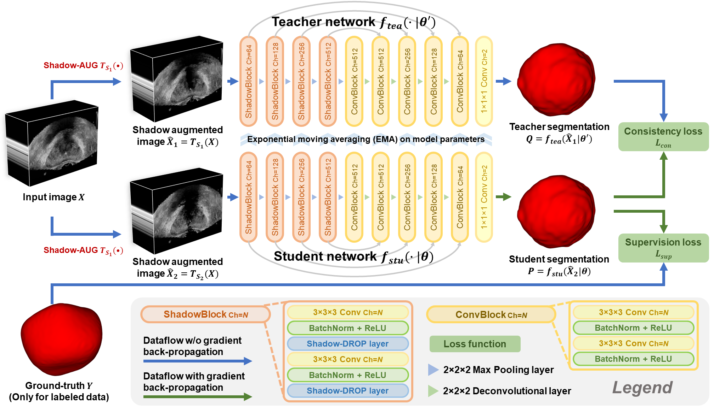
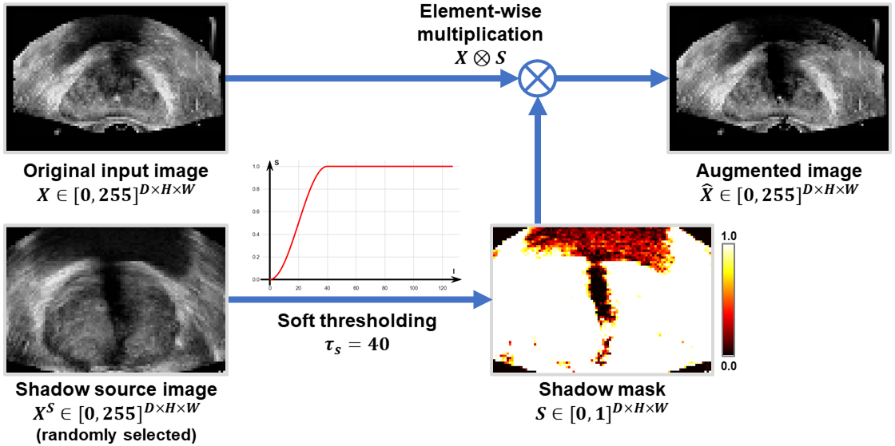
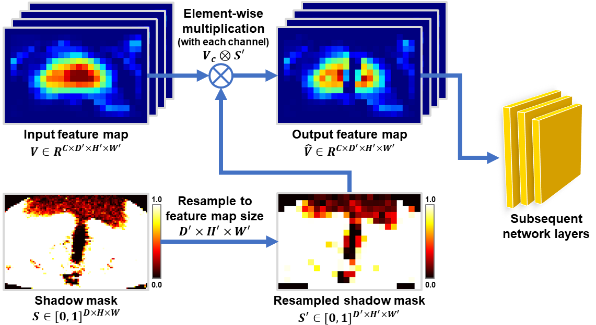

# Shadow-consistent Semi-supervised Learning (SCO-SSL)
Shadow-consistent Semi-supervised Learning for Prostate Ultrasound Segmentation

This is a python (PyTorch) implementation of **Shadow-consistent Semi-supervised Learning (SCO-SSL)** method for prostate ultrasound segmentation proposed in our ***IEEE Transactions on Medical Imaging*** journal paper [**"Shadow-consistent Semi-supervised Learning for Prostate Ultrasound Segmentation"**](https://doi.org/10.1109/TMI.2021.3139999).

## Citation
    @article{Xu2021SCOSSL,
      title={Shadow-consistent Semi-supervised Learning for Prostate Ultrasound Segmentation}, 
      author={Xu, Xuanang and Sanford, Thomas and Turkbey, Baris and Xu, Sheng and Wood, Bradford J. and Yan, Pingkun},
      journal={IEEE Transactions on Medical Imaging}, 
      year={2021},
      volume={},
      number={},
      pages={1-1},
      publisher={IEEE}
      doi={10.1109/TMI.2021.3139999}
    }

## Update
**Mar 23, 2022**: Add a script [`3d_dist_visual.py`](https://github.com/DIAL-RPI/SCO-SSL/blob/main/3d_dist_visual.py) for **3D distance error visualization** that was shown in our paper.

## Method
### Scheme of SCO-SSL

### Scheme of Shadow augmentation (Shadow-AUG)

### Scheme of Shadow dropout (Shadow-DROP)

## Contact
You are welcome to contact us:
  [xux12@rpi.edu](mailto:xux12@rpi.edu)(Xuanang Xu)
  [superxuang@gmail.com](mailto:superxuang@gmail.com)(Xuanang Xu)